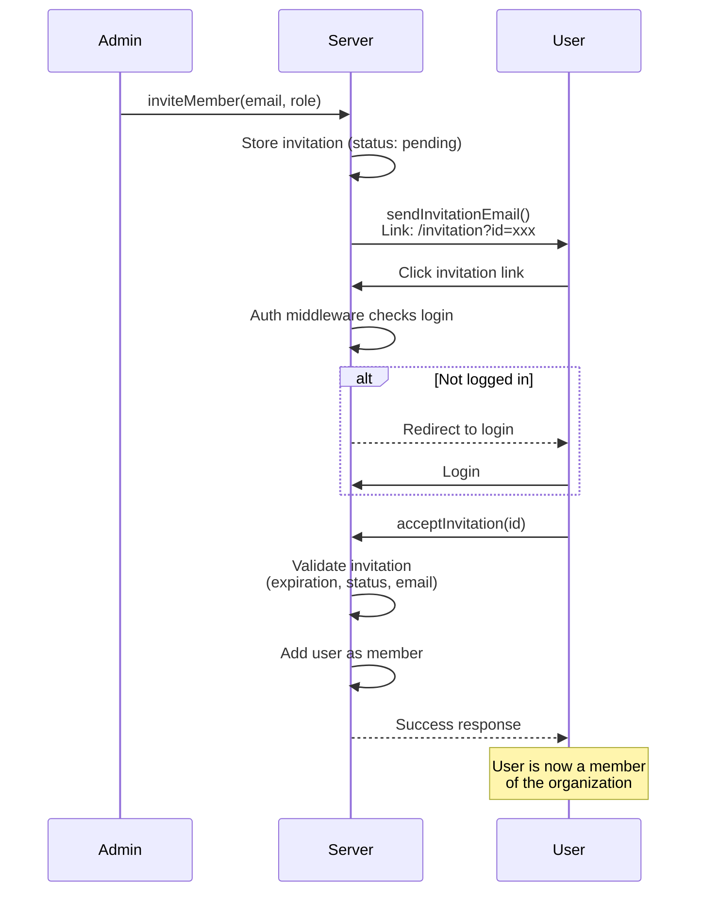

# Flower

A modern Nuxt template

## Getting started

```bash
pnpm install
cp .env.example .env
pnpm run cf:migrate  # apply migrations to local D1 database
docker compose up minio  # mocks R2/S3
pnpm run dev
# open http://localhost:3000
```

For Cloudflare services, check the [deployment](#deployment) section.

## Features

Out of the box:

- **Frontend**:
  - [Vue 3](https://vuejs.org/)
  - [Nuxt 4](https://nuxt.com/)
  - [Nuxt UI 4](https://ui.nuxt.com/)
  - [VueUse](https://vueuse.org/)
  - [Tailwind CSS](https://tailwindcss.com/)
- **Backend**:
  - [tRPC](https://trpc.io/)
  - [Drizzle ORM](https://orm.drizzle.team/)
  - [Better Auth](https://better-auth.com/)
- **Infrastructure**:
  - [Cloudflare Workers](https://developers.cloudflare.com/workers/)
  - [Cloudflare Queues](https://developers.cloudflare.com/queues/)
  - [Cloudflare R2 / S3](https://developers.cloudflare.com/r2/)
  - [Cloudflare Vectorize](https://developers.cloudflare.com/vectorize/)
- **Development**:
  - [ESLint](https://eslint.org/)
  - [TypeScript](https://www.typescriptlang.org/)
  - [pnpm](https://pnpm.io/)

## Development

Simply run `pnpm run dev` to start the development server.

### Auth

We use [Better Auth](https://better-auth.com/) for authentication. Check their
docs for more information.

This app contains the minimal setup for authentication using D1 as the database.

There is a middleware implemented in `app/middleware/auth.global.ts` to protect
routes that are marked with the `auth` meta.

```vue
<script setup lang="ts">
definePageMeta({ auth: true }); // protects the route
</script>
```

If the user is not logged in, they will be redirected to a 404 page. As it is
currently configured, we refresh the session on every route navigation.

#### Organizations

This app includes the Better Auth [organization plugin](https://www.better-auth.com/docs/plugins/organization)
for multi-tenant support. Organizations allow users to collaborate in shared
workspaces with role-based access control (owner, admin, member).

##### Organization Invitation Flow

The following diagram illustrates how organization invitations work:



**Key files:**

- `server/lib/auth.ts` - Server-side auth configuration with `sendInvitationEmail`
- `app/pages/invitation.vue` - Invitation acceptance page
- `app/pages/dash/orgs.vue` - Organization management UI

### API Keys

Users can create and manage API keys for programmatic access via the `/keys`
page. Keys are managed through Better Auth's `apiKey` plugin.

To verify an API key in a server route:

```typescript
const auth = serverAuth(event);
const apiKey = getHeader(event, "x-api-key");
const result = await auth.api.verifyApiKey({ body: { key: apiKey } });
if (!result.valid) {
  throw createError({ code: 401, message: "Unauthorized" });
}
```

See `server/api/protected/test.ts` for a full example.

### Database

The database is managed by Drizzle ORM. Migrations are managed via `drizzle-kit`
and applied to Cloudflare D1.

The following command generate types for Better Auth, based on the configs in
`auth.config.ts`, and outputs the schema for the auth related tabels in
`server/db/auth.ts`. The schema is imported into the `server/db/schema.ts` file,
which is useed by the app, giving us automatic type safety for all database
operations. It also generate the SQL migrations in `server/db/migrations`.

```bash
pnpm run db:generate
```

The following command will apply the migrations to the Cloudflare D1 database.

```bash
pnpm run db:migrate
pnpm run db:migrate --remote  # updates remote database
```

### Storage

There are two storage providers: S3 and R2. S3 can be used with any S3
compatible storage provider. R2 is a Cloudflare specific storage provider.

We use `minio` to mock the S3 storage provider.

```bash
docker compose up minio
# console on http://localhost:9001
```

Unfortunately, R2 bindings do not give us a way to presign URLs for objects. So
we need to use the `@aws-sdk/s3-request-presigner` and configure S3 compatible
vars from R2 to be able to presign URLs for objects.

## Deployment

This project was primarily made to work with Cloudflare workers. But it can be
easily modified to run anywhere Nuxt can run.

For Cloudflare services, you might need to update your `wrangler.jsonc` to use
the correct bindings. You can create bindings by using:

```bash
pnpm wrangler d1 create '<NAME>'
pnpm wrangler vectorize create '<NAME>'
pnpm wrangler r2 bucket create '<NAME>'
pnpm wrangler kv namespace create '<NAME>'
pnpm wrangler queues create '<NAME>'
```

The following command will generate all types for Cloudflare and Better Auth,
before running the build and deploying to Cloudflare.

```bash
pnpm run cf:deploy
```

### Secrets

You can quickly update production secrets by running:

```bash
pnpm run cf:secrets
# or
wrangler secret bulk .env
```

This will prompt you for the secrets and update the `.env` file.

### `global_fetch_strictly_public`

You MUST set the 'global_fetch_strictly_public' compatibility flag to true in
your `wrangler.jsonc` file.

Why? Because internal requests have an issue where they don't go through the
whole request pipeline of a normal request coming from the internet. For
example, any requests being made during the hydration process, like trpc calls
and auth calls, will fail. I don't know the specifics, but for me, it would not
go trought request context creation and such, resulting in the `Env` object from
Cloudflare bindings not being available.
